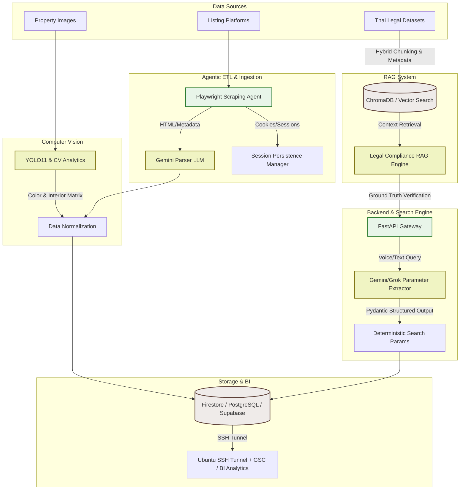

# Yourhome Core AI & Automation Infrastructure

[](https://python.org)
[](https://fastapi.tiangolo.com)
[](https://deepmind.google/technologies/gemini/)
[](https://www.docker.com)
[](https://playwright.dev)
[](#)

A production-grade, enterprise-scale AI and automation core powering the **Yourhome** real-estate platform. This infrastructure automates unstructured property data ingestion, enables multi-modal natural language search, conducts image-based computer vision analytics, performs localized legal RAG analysis, and runs automated BI data warehousing and programmatic QA fuzzing pipelines.

Designed for developers, AI engineers, and DevOps teams to orchestrate and scale intelligent property services.

---

## 🏗️ System Architecture

The following diagram illustrates the data flows, agent lifecycles, and backend integrations across the Yourhome Core infrastructure:



---

## 🌟 Core Features

### 1. Autonomous AI ETL & Knowledge Ingestion Agent
*   **Session-Persisted Aggregation:** Orchestrates Playwright browser automation with persistent session and cookie management to navigate past authentication blocks on major listing platforms.
*   **LLM-Powered Data Normalization:** Uses Gemini 1.5 models to parse highly unstructured, free-form property description texts, translating them into highly deterministic, structured database-friendly JSON schemas.

### 2. Computer Vision Analytics
*   **YOLO11 Model Pipeline:** Analyzes property images to automatically identify structural layouts, room types, and aesthetic quality.
*   **Design & Color Matrix Extraction:** Extracts dominant color palettes (RGB/HEX) and interior design profiles to automatically tag and index listings.

### 3. Intelligent Search & Extraction Engine
*   **Natural Language to Parameters (NL2Params):** FastAPI endpoint processing voice or text inputs.
*   **Deterministic Parameter Mapping:** Combines LLMs (Gemini/Grok) with Pydantic Structured Outputs and custom regular expressions to extract clean filters (e.g., price ranges, location, bedroom counts) from conversational queries.

### 4. Legal Compliance RAG System
*   **Hallucination Mitigation:** Retrieval-Augmented Generation (RAG) system utilizing localized Thai legal datasets to answer real-estate-specific regulatory and transactional queries.
*   **Hybrid Chunking & Retrieval:** Combines semantic Vector search (ChromaDB/Supabase) with keyword search (BM25 tokenized by PyThaiNLP) for maximum accuracy.

### 5. Data-Driven BI Analytics
*   **Automated Ubuntu SSH Tunnels:** Programmatically opens secure tunnels connecting AWS RDS production databases with Google Search Console.
*   **User Lifecycle Tracking:** Direct automated ingestion loops mapping search console clicks, user acquisition channels, and registration drop-offs.

### 6. Automated QA Pipeline
*   **Programmatic Fuzz & Logic Testing:** Fuzzing bot that systematically hits API endpoints with extreme boundaries and mock schemas.
*   **Regression Prevention:** Automated test assertions evaluating downstream data consistency and security checks across database layers.

---

## 🛠️ Tech Stack & Infrastructure Checklist

| Component | Technology | Role in System | Status |
| :--- | :--- | :--- | :---: |
| **Core Language** | Python 3.11+ | Implements clean code, Pydantic type safety, and core scripts. | `[x]` Enforced |
| **API Gateway** | FastAPI | Hosts low-latency search endpoints, ingestion hooks, and RAG routes. | `[x]` Enforced |
| **AI Models** | Gemini 1.5 Flash / Pro | Powers description parsing, prompt-based extraction, and RAG. | `[x]` Enforced |
| **Alternative LLM** | Grok | Fallback/parallel extractor for search query processing. | `[x]` Configured |
| **Computer Vision** | YOLO11 | Processes property images to extract room categories and styles. | `[x]` Enforced |
| **Browser Driver** | Playwright | Executes headless scraping tasks with cookie/session persistence. | `[x]` Enforced |
| **Vector Database** | ChromaDB / Supabase | Houses legal embeddings and property embeddings for semantic query matching. | `[x]` Enforced |
| **Relational Database**| PostgreSQL (AWS RDS)| Acts as the production transactional database and core BI data source. | `[x]` Enforced |
| **NoSQL Database** | Firestore | Stores unstructured listing schemas and temporary scraper metadata. | `[x]` Enforced |
| **Data Integration** | Google Sheets API | Serves as an output sink for automated reports and analytics dashboards. | `[x]` Enforced |
| **Orchestration** | Google Cloud Scheduler| Triggers ETL tasks, BI synchronizations, and QA fuzzers on cron jobs. | `[x]` Enforced |
| **Infrastructure** | Docker | Containers for FastAPI, agents, and worker processes. | `[x]` Configured |
| **Cloud Hosting** | GCP Cloud Run | Hosts serverless FastAPI and background worker microservices. | `[x]` Configured |
| **Network Security** | Linux SSH Tunnels | Securely connects AWS RDS databases to isolated BI metrics collectors. | `[x]` Enforced |

---

## 🔑 Environment Variables Template

Create a `.env` file in the root directory using this template:

```ini
# ==============================================================================
# Yourhome Core AI & Automation Infrastructure - Environment Configuration
# ==============================================================================

# FastAPI Server Settings
HOST=0.0.0.0
PORT=8000
ENV=development # production, staging, development

# Core AI API Keys
GEMINI_API_KEY=your_gemini_api_key_here
GROK_API_KEY=your_grok_api_key_here

# Scraping & Automation Configs
PLAYWRIGHT_HEADLESS=true
COOKIE_SESSION_PATH=./src/agents/sessions/cookie_state.json
SCRAPER_MAX_CASES=50
SCRAPER_DELAY_SEC=3

# Databases & Vector Stores
FIRESTORE_PROJECT_ID=your_firestore_project_id
FIRESTORE_CREDENTIALS_PATH=./secrets/firestore-service-account.json

POSTGRES_HOST=your-rds-endpoint.amazonaws.com
POSTGRES_PORT=5432
POSTGRES_DB=yourhome_prod
POSTGRES_USER=db_user
POSTGRES_PASSWORD=secure_password_here

SUPABASE_URL=https://your-supabase-project.supabase.co
SUPABASE_KEY=your_supabase_anon_or_service_role_key
VECTOR_COLLECTION_NAME=property_legal_vectors

# BI & Integrations
GOOGLE_APPLICATION_CREDENTIALS=./secrets/google-bi-service-account.json
GOOGLE_SHEETS_SPREADSHEET_ID=your_spreadsheet_id_for_reports
GSC_SITE_URL=https://yourhome.com

# SSH Tunnel for RDS Connection
SSH_TUNNEL_HOST=your-ubuntu-bastion-ip
SSH_TUNNEL_PORT=22
SSH_TUNNEL_USER=ubuntu
SSH_TUNNEL_KEY_PATH=./secrets/bastion-key.pem

# Automated QA & Fuzzing
TEST_ENDPOINT_URL=http://localhost:8000
QA_FUZZER_API_KEY=internal_qa_security_token
```

---

## 📂 Directory Structure

Below is the repository's logical layout optimized for modular AI agents, clean services separation, and scale:

```
├── src/
│   ├── agents/          # AI Agents, Prompt Engineering, RAG & LLM logic
│   ├── room_analyzer/   # Computer Vision, Image quality & Color detector scripts
│   ├── services/        # Database connectors (Firestore, AWS RDS, Sheets API)
│   ├── api/             # FastAPI routers and endpoints
│   └── main.py          # Application entry point
├── requirements.txt     # Dependency list
└── README.md
```

### Module Contexts (For AI Agents and Developers)
- [src/agents/](file:///c:/Users/yourh/Desktop/PersonalProject/RAG_Local_Law/src/agents/): Hosts core agent configurations, LLM-based parsing prompts, and RAG retrieval pipelines. This is the main orchestrator for unstructured data processing.
- [src/room_analyzer/](file:///c:/Users/yourh/Desktop/PersonalProject/RAG_Local_Law/src/room_analyzer/): Houses image feature classifiers and YOLO11 computer vision routines.
- [src/services/](file:///c:/Users/yourh/Desktop/PersonalProject/RAG_Local_Law/src/services/): Centralizes DB gateways, authentication handshakes, and third-party API configurations (Firestore, AWS RDS, Sheets API).
- [src/api/](file:///c:/Users/yourh/Desktop/PersonalProject/RAG_Local_Law/src/api/): Structures the REST endpoints, router logic, middleware, and schemas for search interfaces.
- [src/main.py](file:///c:/Users/yourh/Desktop/PersonalProject/RAG_Local_Law/src/main.py): The root Uvicorn entry point initializing the FastAPI app state, setting up CORS, and registering microservices.

---

## 🚀 Getting Started

Follow these instructions to set up the development environment locally.

### Prerequisites
- Python 3.11 or higher
- Docker (optional, for containerized runtimes)
- Node.js (required for Playwright drivers)

### 1. Clone & Set Up Directory
Clone the repository and navigate to the root directory:
```bash
git clone https://github.com/your-org/yourhome-core-ai.git
cd yourhome-core-ai
```

### 2. Create and Activate a Virtual Environment
Using Python's standard `venv` module:

**On macOS/Linux:**
```bash
python3 -m venv venv
source venv/bin/activate
```

**On Windows (PowerShell):**
```powershell
python -m venv venv
.\venv\Scripts\Activate.ps1
```

### 3. Install Dependencies
Install the required packages, including PyTorch for YOLO11 CV tasks, and set up Playwright browser instances:
```bash
pip install -r requirements.txt
playwright install chromium
```

### 4. Configuration
Duplicate the environment template and edit with your API keys and databases:
```bash
cp .env.example .env
```

### 5. Launch the Server Locally
Run the FastAPI application locally using Uvicorn with hot-reloading enabled:
```bash
uvicorn src.main:app --host 127.0.0.1 --port 8000 --reload
```
Once started, you can access the Interactive Swagger documentation at `http://127.0.0.1:8000/docs`.

### 6. Executing Scripts
- **Scraper / ETL Agent:** `python -m src.agents.etl_ingest`
- **Vision Inference:** `python -m src.room_analyzer.color_detect`
- **QA Fuzz Bot:** `python -m src.api.qa_fuzzer`
